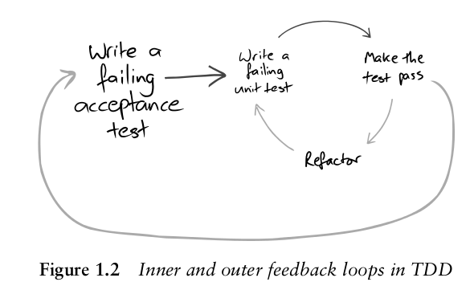

# Exam: Acceptance Test–Driven Development based on [Concordion](https://github.com/concordion/concordion)

>Illustration from *"Growing Object-Oriented Software, Guided by Tests"*
>[](#attributions)

[](https://bintray.com/adven27/exam/exam?source=watch)
[  ](https://bintray.com/adven27/exam/exam-ms/_latestVersion)
[](https://masterminds.github.io/stability/active.html)

[](https://jitpack.io/#Adven27/Exam)
[](https://jitci.com/gh/Adven27/Exam)


**Exam** is oriented on **declarative end-to-end black\graybox** application testing in a way a manual tester would do it: send request, verify response\database\message queue etc.

## Features

- **Declarative glue-code free** approach
- **Attractive, flexible documentation** thanks to Concordion
- **Widly used set of testing tools** under the hood: *dbunit, rest-assured, xml-unit, json-unit*

## Getting started
### 1) Install

Maven
```xml
<repositories>
    <repository>
      <id>jcenter</id>
      <url>https://jcenter.bintray.com/</url>
    </repository>
</repositories>  
```
```xml
<dependency>
    <groupId>org.adven.concordion.ext</groupId>
    <artifactId>exam-ms</artifactId>
    <version>4.4.3</version>
</dependency>
```

Gradle
```groovy
repositories {
    jcenter()
}

testCompile "org.adven.concordion.ext:exam-ms:4.4.3"
```
### 2) Use

For detailed info, [see original tutorial](http://concordion.org/tutorial/java/markdown/)

`specs.Specs.java`
```java
public class Specs extends AbstractSpecs {
    private static ConfigurableApplicationContext SUT;

    @Override
    protected ExamExtension init() {
        return new ExamExtension(
            new WsPlugin(8080),
            new DbPlugin("org.postgresql.Driver", "jdbc:postgresql://localhost:5432/postgres", "postgres", "postgres"),
            new MqPlugin(Map.of("kafka", new KafkaTester("PLAINTEXT://localhost:9092", "topic")))
        );
    }

    @Override
    protected void startSut() {
        SpringApplication app = new SpringApplication(Main.class);
        app.setAdditionalProfiles("qa");
        SUT = app.run();
    }

    @Override
    protected void stopSut() {
        SUT.stop();
    }
}
```

`specs\Specs.md`
```html
# API

- [User creation]( usercreation/UserCreation.html "c:run")
```

`specs.usercreation.UserCreation.java`
```java
public class UserCreation extends Specs {
}
```

`specs\usercreation\UserCreation.html`
```html
<html xmlns:e="http://exam.extension.io">
<body>
    <h1>User creation</h1>
    <e:summary/>
    <e:example name="My dummy user creation example">
        <e:given>
          Given users:
          <e:db-set table="user" cols="name, age, id=1..10">
              <e:row>Andrew, 20</e:row>
              <e:row>Bob   , 30</e:row>
          </e:db-set>
        </e:given>
        <e:post url="users">
          <e:case desc="When name and age was posted user should be created and id should be returned">        
            <e:body> {"name": "Carl", "age": 40} </e:body>
            <e:expected> {"id": "{{number}}"} </e:expected>
            <e:check>
                <e:db-check table="person" cols="name, age">
                  <e:row>Andrew, 20</e:row>
                  <e:row>Bob   , 30</e:row>
                  <e:row>Carl  , 40</e:row>
                </e:db-check>
            </e:check>
          </e:case>      
          <e:case desc="Age is optional">
            <e:body> {"name": "Don"} </e:body>
            <e:expected> {"id": "{{number}}"} </e:expected>
            <e:check>
                <e:db-check table="person" cols="name, age" where="name='Don'">
                  <e:row>Don, {{NULL}}</e:row>
                </e:db-check>
            </e:check>
          </e:case>
        </e:post>
    </e:example>
</body>
</html>
  ```
For more info, [see live spec](https://adven27.github.io/Exam/specs/Specs.html)

Telegram https://t.me/joinchat/DClprRZ1xDCBtjGexhZOGw
